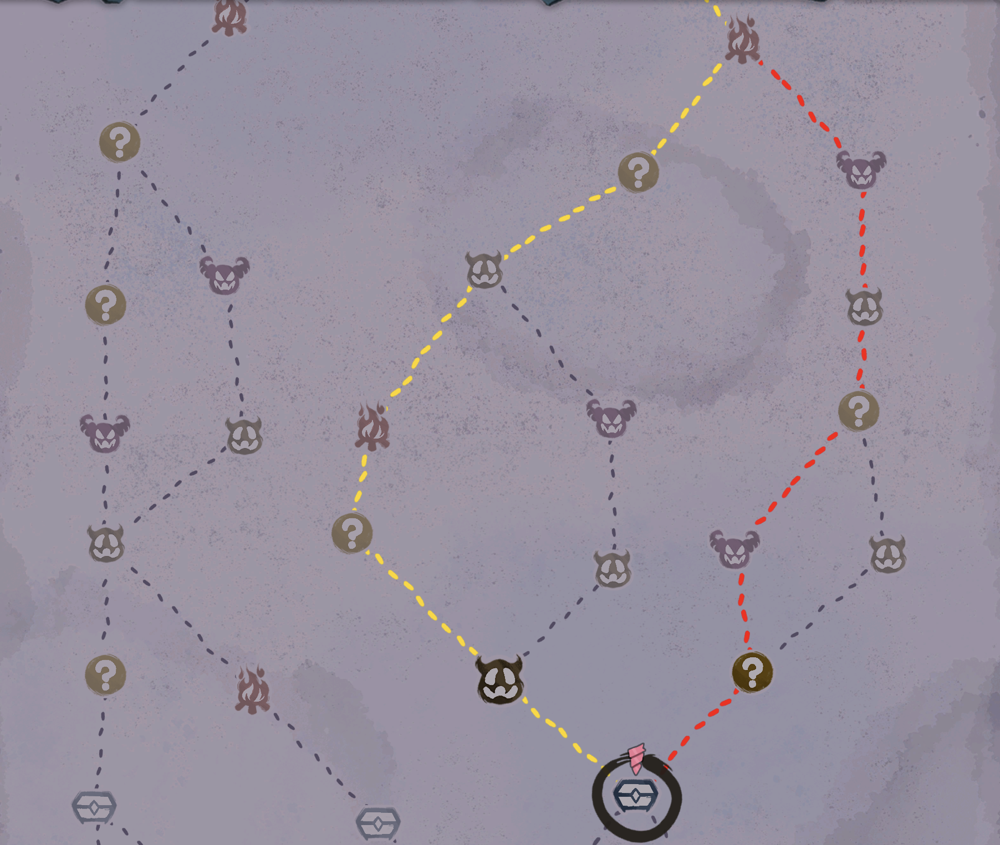

<div align="center">
  <a href="README.md">English</a> | <a href="README_ZH.md">简体中文</a>
</div>

# RouteSuggest - 杀戮尖塔2 (Slay the Spire 2) 模组



一个《杀戮尖塔2》的模组，用于为你计算地图上的最佳路线，并在地图界面上将其高亮显示。

_基于 Jiajie Chen @jiegec 的原版 STS2RouteSuggest 模组，修改为使用动态规划 (Dynamic Programming) 算法以及全新的基于目标的路线匹配。_

**支持的游戏版本：** v0.99.1 和 v0.100.0 (公开测试版)

## 功能特点

- **高级寻路**：使用高性能的动态规划 (DP) 算法，实现最佳计算速度和强大的匹配最近路线能力。
- **视觉高亮**：默认提供三条路线高亮：
  - **绿色**：安全路线 (避开精英)
  - **红色**：激进路线 (优先挑战精英)
  - **黄色**：问号路线 (优先前往未知地点)
- **智能评分**：可以为不同的游玩风格配置基于目标的权重。
- **GUI 配置**：可通过 ModConfig 在游戏内进行全面配置（可选）。
- **手动配置**：高级用户可以直接进行 JSON 配置。

## 安装指南

1. 从 [GitHub Releases](https://github.com/14qwq14/Better-Smart-Route)下载最新版本。
2. 将模组文件解压到你的《杀戮尖塔2》 mods 文件夹中（`mods` 文件夹应与游戏可执行文件位于同一目录）：
   - **Windows**: `C:\Program Files (x86)\Steam\steamapps\common\Slay the Spire 2\mods\`
   - **macOS**: `~/Library/Application\ Support/Steam/steamapps/common/Slay\ the\ Spire\ 2/SlayTheSpire2.app/Contents/MacOS/mods/`
   - **Linux**: `~/.steam/steam/steamapps/common/Slay\ the\ Spire\ 2/mods`
3. 启动《杀戮尖塔2》 - 模组将自动加载。

## 源码编译

### 环境要求

- .NET 9.0 SDK 或更高版本
- Godot 4.5.1（支持 Mono）
- 《杀戮尖塔2》（需要引用 sts2.dll）

### 编译步骤

```bash
# 克隆仓库
git clone https://github.com/14qwq14/Better-Smart-Route
cd Better-Smart-Route

# 编译模组
./build.ps1
```

使用动态规划 (DP) 算法根据目标值和评分计算最佳路径。相较于基础的搜索方法，这提供了更好的性能和稳健的最优路径匹配。

默认情况下，会计算以下三条基于目标的路线：

### 安全 (绿色)

尽可能减少艰难的战斗，让旅程更安全：

- **精英 (Elite)**: 权重 0 (避开精英)

### 激进 (红色)

优先考虑战斗奖励和高价值目标：

- **精英 (Elite)**: 权重 +15

### 问号 (黄色)

优先考虑地图探索和随机事件：

- **未知 (Unknown)**: 权重 +15

当路线共享同一条边时，它们会根据渲染优先级在地图界面上重叠显示，或者混合显示为其他颜色（如亮金色）。

## 配置说明

### GUI 游戏内设置 (推荐)

RouteSuggest 可以选择集成 [**ModConfig**](https://github.com/xhyrzldf/ModConfig-STS2)。安装 ModConfig 后，RouteSuggest 会出现在游戏的 **设置 > 模组 (Mods)** 菜单中。如果没有安装 ModConfig，模组仍然可以正常工作，但你需要手动编辑 JSON 配置文件（见下文）。

通过 ModConfig GUI，你可以配置：

- **通用设置**:
  - **高亮类型 (Highlight Type)**: 选择高亮一条最佳路径还是所有最高分的路径。
    - **单条 (One)**: 从最优路径中挑选一条。
    - **全部 (All)**: 高亮所有并列最高分的路径。
- **配置每条路线**:
  - **启用 (Enabled)**: 切换以启用/禁用此路线（禁用的路线不会被计算或显示）。
  - **名称 (Name)**: 路线的标识名。
  - **颜色 (Color)**: 输入十六进制颜色代码（例如 `#FFD700` 表示金色，`#FF0000` 表示红色）。
  - **优先级 (Priority)**: 设置渲染优先级的滑块（数值越高，重叠时显示在越上层）。
  - **评分权重 (Scoring Weights)**: 设置每种房间类型权重的滑块。
    - 正数 = 偏好该房间类型
    - 负数 = 避开该房间类型
    - 0 = 中立
- **添加新路线**: 拖动滑块添加新路线（滑到 1）。
- **移除路线**: 每条路线都有一个移除滑块（0=保留，1=移除）。
- **重置为默认值**: 将所有路线重置为默认配置的滑块。
- **修改会自动保存** 到配置文件路径（详情见下文）。

### 手动 JSON 配置

你也可以通过直接编辑 `RouteSuggestConfig.json` 来手动自定义路线类型：

- **现有用户**: 如果你已经在 `mods/RouteSuggestConfig.json` 拥有配置文件，它将被继续使用（不需要迁移）。
- **新用户**: 配置文件将会和 `RouteSuggest.dll` 保存在一起（在 mods 文件夹中递归查找）。如果找不到 DLL，将退回到 `mods/RouteSuggestConfig.json`。
- **注意**: 配置会保存到它被读取的同一位置。模组不会自动将配置文件迁移到其他位置。

```json
{
	"schema_version": 3,
	"highlight_type": "One",
	"path_configs": [
		{
			"name": "Safe (Green)",
			"color": "#00FF00",
			"priority": 100,
			"enabled": true,
			"scoring_weights": {
				"Elite": 0
			}
		},
		{
			"name": "Aggressive (Red)",
			"color": "#FF0000",
			"priority": 50,
			"enabled": true,
			"scoring_weights": {
				"Elite": 15
			}
		},
		{
			"name": "Question marks (Yellow)",
			"color": "#FFFF00",
			"priority": 75,
			"enabled": true,
			"scoring_weights": {
				"Unknown": 15
			}
		}
	]
}
```

- **enabled**: 设置为 `false` 可禁用路线（被禁用的路线不会计算评分，也不会显示在地图上）。
- **color**: 十六进制颜色代码（如 `#FFD700` 代表金色，`#FF0000` 代表红色）。
- **priority**: 优先级，数字越大在路线重叠时渲染在越上层。
- **scoring_weights**: 各类房间的整数权重（正数代表倾向前往，负数代表避开）。

| 字段              | 类型    | 说明                                                                           |
| :---------------- | :------ | :----------------------------------------------------------------------------- |
| `schema_version`  | Integer | 配置版本号，目前固定为 3。                                                     |
| `highlight_type`  | String  | 高亮模式：`One` (仅高亮一条最高分路线) 或 `All` (高亮所有最高分路线)。         |
| `path_configs`    | Array   | 路线配置的数组，如果为空或缺失，会使用默认三条路线。                           |
| `name`            | String  | 路线名称（主要用于在 ModConfig 中显示）。                                      |
| `color`           | String  | 高亮颜色代码，支持十六进制 (如 `#FFD700`)。                                    |
| `priority`        | Integer | 当多条路线重叠时，priority 更高的颜色会画在上面。                              |
| `enabled`         | Boolean | 为 `true` 时启用该路线计算与显示，为 `false` 时禁用该路线。                    |
| `scoring_weights` | Object  | 记录目标节点类型的整数权重。正值吸引，负值排斥，未填写的房间类型权重默认为 0。 |

**支持的房间类型（用于 `scoring_weights`）：**

- `RestSite` (休息处)
- `Treasure` (宝箱)
- `Shop` (商店)
- `Monster` (怪物)
- `Elite` (精英)
- `Unknown` (未知)

如果配置文件缺失或无效，将使用默认的路线配置。

## 更新日志

### v1.8.0

- 优化 ModConfig UI：将滑块改为开关，配置更简便。
- 为各个路线配置添加了 启用/禁用 选项。
  - 被禁用的路线不会进行计算并在地图上显示。
  - 可同时在 ModConfig GUI 和 JSON 配置文件中使用此功能。
- 在游戏测试版 v0.100.0 上进行了测试。

### v1.7.0

- 将 `affects_gameplay` 设置为 false，因为这是一个纯视觉模组，不影响游戏玩法内容。

### v1.6.0

- 优化了配置文件的路径解析。
  - 根据用户反馈：如果 mods 文件夹中模组很多，将配置文件放在根目录会显得非常混乱。
  - 如果 `mods/RouteSuggestConfig.json` 已经存在，则继续使用它（无需改变）。
  - 否则，递归查找 `RouteSuggest.dll` 并将配置保存在它的旁边。
  - 如果未找到 DLL，则回退为 `mods/RouteSuggestConfig.json`。
  - 配置保存的位置与读取的位置相同（不进行自动迁移）。

### v1.5.0

- 增加 HighlightType (高亮类型) 选项以控制要高亮显示几条路线。
  - **One**: 从所有最优路径中仅挑选一条显示。
  - **All**: 高亮显示所有并列最高分的路线。
  - 此选项可以在 ModConfig GUI 和 JSON 配置中使用。

### v1.4.0

- 添加了与 ModConfig 集成的游戏内 GUI 设置功能，用于在游戏中进行配置。
  - 可通过 GUI 配置路线名称、颜色（16位制输入）、优先级以及各类房间的评分权重。
  - 添加/移除自定义类型的路线。
  - 更改内容会自动保存至 JSON。
  - 增加英语和简体中文的国际化支持。
- 在游戏测试版 v0.99.1 上进行了测试。

## ���� (License)

����Ŀ���� [MIT License](LICENSE) ��Դ��
